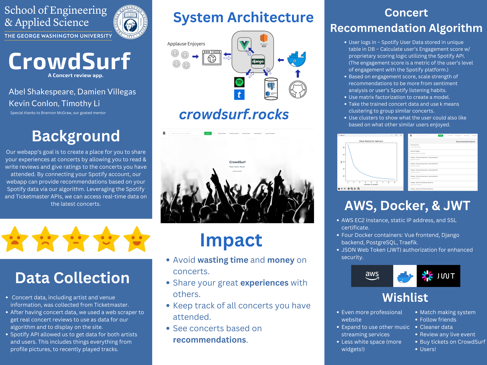
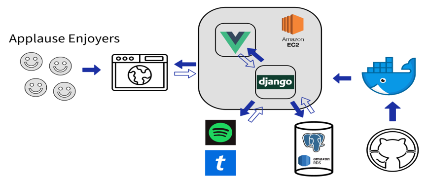
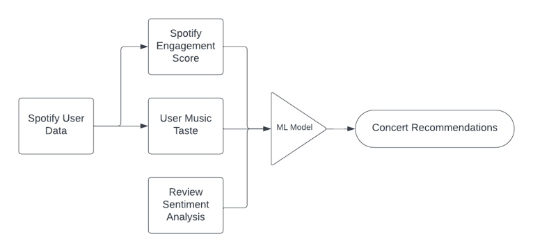

# CrowdSurf

GW Senior Design Project by Damien Villegas, Kevin Conlon, Timothy Li, and Abel Shakespeare

## Description

[**CrowdSurf**](https://damienvillegas.github.io/crowdsurf/): Read. Dance. Review.


Project Elements: web scraping, machine learning, cyber security, web development, web hosting, design, API integration


Spending the *time* and *money* to see your favorite artist can be a rewarding experience, and the memories made can be cherished forever. On the other hand, you might have exhausted a lot to see an artist, and the entire show did not meet your expectations. Finally, you may have never been to a concert and wonder if it is worth it. *CrowdSurf* is a new concert review app for all the previously described situations. Our team wanted to make a unified location for people to share their thoughts on concerts, give ratings, see what concerts their friends have been to, provide recommendations for what concerts we think they would enjoy, and more. It is a place for people to share photos, videos, and their entire experience, whether it was good or bad. 

## Poster



## Tech Specifications

### System Architecture:



### Frontend (Kevin, Abel, Timothy, Damien):
- Written in Vue.js
- Versatile and reactive
- Vue components allow for reuseabilty and easy implementation
- Uses Axios to connect with backend to call API requests for necessary data
 

### Backend (Damien, Kevin, Abel):
- Written in Django
- Use of Django Models allows us to have our PostgreSQL database data represented in a way that can be easily used by the frontend
- Data created in frontend (creation of reviews or new concerts to add to the database) can be sent using Axios to backend 

### Data Collection (Damien, Timothy, Abel):
- Python libraries like BeautifulSoup used to gather real concert reviews and other data
- Ticketmaster API
- Spotify API
- Fake users generated using python scripts

### Recommendation Algorithm (Abel, Damien):
- Get user ratings for concerts
- Use matrix factorization to create a model
- Take the trained concert data and use k means clustering to group similar concerts
- User’s Spotify engagement store calculated from number of unique tracks, new playlists, other data from their account
- Use clusters to show what the user could also like for the last 3 recommendations based on what other similar users enjoyed



### Hosting the Site (Damien):
- AWS EC2 Instance
- Containerized with Docker
- AWS Route 53
- Bought domain name ```crowdsurf.rocks``` and SSL certificate

### Security (Abel, Timothy):
- Spotify Authorization with encrypted storage of data
- JSON Web Token (JWT) authorization for enhanced security
- HTTPS domain

## Showcase

Below is a GIF of my our final presentation, which showcases a demo of the CrowdSurf site. Every six seconds, the next screenshot appers.
You can also view the slides [here](https://docs.google.com/presentation/d/1pLR6xX6Iv9nac4E0i7_OrZberT7WdU5o2ohE6Knynpk/edit#slide=id.p).
For more information visit go the GitHub page [here](https://damienvillegas.github.io/crowdsurf/).


## Wishlist
- Follow friends
- Cleaner data
- Even more professional website, Figma
- Language filters for bad words
- Less white space (more widgets!)
- Expand into sports or other events
- Concert matchmaking system
- Users!
